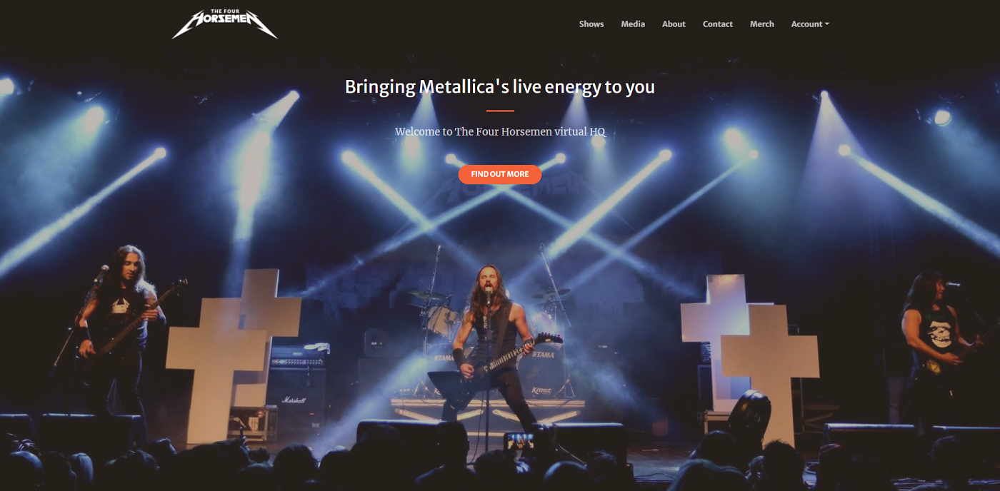

<div align="center">

<br>
Brazilian METALLICA tribute band
</div>

# Overview

This is the virtual HQ of one of the most important Metallica tribute bands from South America, called THE FOUR HORSEMEN. A responsive website for those interested in finding out more about the band's history and activities, our members, merchandising, upcoming shows and taking the band to their city/country.

tribute band born in 2003, aiming to reproduce the spirit and presence of the most extraordinary band in the world, METALLICA. Underneath the passion for their style and sound, our band's restless motivation is to bring the audience the feeling of being in an authentic Metallica concert.

The aim of this web application is to strengthen our online presence, gathering all the information spread over other social media platforms and have the chance to sell band merchandising products, as well as increase show business managers interactions, offering a proper communication channel.

---


[Access the App here](https://t4h-portal-app.herokuapp.com/)

**Please note**: To open any links in this document in a new browser tab, please press `CTRL + Click`.

---

# Table of Contents

- [User experience](#user-experience)
  * [User Stories](#user-stories)
- [Strategy](#strategy)
- [Scope](#scope)
  * [Existing Features](#existing-features)
- [Structure](#structure)  
  * [Databases](#databases)
- [Skeleton](#skeleton)
  * [WireFrames](#wireframes)    
- [Surface](#surface)   
- [Technologies Used](#technologies-used)
  * [Languages](#languages)  
  * [Dependencies](#dependencies)
  * [Integration](#integration)  
  * [Tools](#dependenciess)

### Structure

## User experience

### User Stories

- Anonymous user

  - As an anonymous user, I want to easily navigate the site and quickly find info about the band;
  - As an anonymous user, I want to navigate through a responsive app and be able to access it by mobile, tablet or desktop device nicely;
  - As an anonymous user, I want to get more details about the band, its media sources and history and consider booking the band;
  - As an anonymous user, I want to check the upcoming concert dates quickly browsing the band tour calendar;
  - As an anonymous user, I want to find the band's social media channels, so that I can start following them;
  - As an anonymous user, I want to see videos and photos and check their live performances;
  - As an anonymous user, I want to check the merchandising items and their prices, so that I can place an order and support the band;
  - As an anonymous user, I want to access contact details, so that I can get in touch to book the band;
  - As an anonymous user, I want to register for a user profile account by email and password and store details of orders history;

- Registered user

  - As a registered user, I want to log in and log out of my profile account and keep my information safe for future accesses;
  - As a registered user, I want to update my details, so that I can change my delivery address for future purchases;
  - As a registered user, I want to store my details for later use, avoiding to retype it on the next purchase;
  - As a registered user, I want to store my purchase history and check the goods delivery status;
  - As a registered user, I want to select the quantity of each product I want to order, entering the quantity of each I want to purchase;
  - As a registered user, I want to review my purchase choices at checkout, so that I can decide to add or remove products before confirming;
  - As a registered user, I want to store my choices in checkout and go back to the site in case I wish to change the options;
  - As a registered user, I want to make secure payments and ensure my payments are securely handled;
  - As a registered user, I want to receive an email confirmation of my order, so that I can confirm that my order was confirmed;
  - As a registered user, I want to log in to my profile account and keep track of my order's delivery status;

-  Site admin user.

   - As an admin user, I want to add new concert dates, so that I can keep fans updated on upcoming dates;
   - As an admin user, I want to update concert dates, so that I can update fans on existing concert dates;
   - As an admin user, I want to delete concert dates, so that I can remove concert dates cancelled;
   - As an admin user, I want to update merchandising products listing and update new items info;
   - As an admin user, I want to delete existing merchandising products listing, so that I can avoid out of stock items for customers;
   - As an admin user, I want to add new merchandising products and category listings, so that I can make new items available for purchasing;
   - As an admin user, I want to update orders delivery status, so that I can keep customers updated on the delivery of their items;

### Strategy

With over 17 years of experience consistently touring Brazil, some gigs in Latin American countries and a tour in Portugal and Spain, THE FOUR HORSEMEN has become an increasingly strong and professional live music project.

This website project comes to show we take work behind the scenes as seriously as being on the road and performing live.

The strategy of this website is to translate our stage presence, giving us a boost in the right direction by selling merch, booking concerts amd bringing potential fans and the live music industry closer to us.

#### Project Goals

Increase internet presence presenting relevant content about the band and improving its positioning in the main internet search engines. Increasing number of fans, increasing concert bookings and merchandising sales.

#### User Goals

Users can easily find info about the band, see photos and videos, purchase merch or book concerts.

### Scope

Built based on technologies such: HTML, CSS, JavaScript, Python and Django.

#### Existing Features

- Fully responsive website across all popular devices, using Bootstrap Grid and custom media queries
- Intuitive and responsive Navigation menu
- About section on Home page to read the band concept
- Shows section on Home page to read the upcoming concert dates
- Media section with an interactive lightbox with images and Youtube embedded live performance videos  
- Merch page with available band merchandise 
- Login page with form
- Profile/account page
- Checkout page
- Order history and status page
- Footer element with social media links.
- Ability for admin user to add, update and delete concert date entries.
- Ability for admin to add, update and delete stock merch entries.
- Ability for admin to update orders delivery status.


#### Future Features to Implement

- Login with other Social Media options
- Share content with other Social Media apps
- Media content manageable by Admin system
- Forgot Password feature
- Past Dates on Shows section.
- Implement further communication to the user via email for order invoices & confirmation.

### Structure

The structure is a mix of a single page application, easing the navigation to each content with section hinting for quick impact, and a multiple page application with progressive steps along the purchase process, making it easier.

#### Interaction Design and Architecture

A template with a full-width content area to layout texts, images and photos aiming straightforward navigation supported by Django apps built using bootstrap 5 Html elements
All the content is organized according to the main menu at the top, clearly presenting the user the sections sequence.

#### Databases

- [SQLite3](https://www.sqlite.org/index.html) used in Development, which comes as default with Django installation.
- [Heroku Postgres](https://www.heroku.com/postgres) used in Production, by Heroku cloud environment.

#### Apps and Models used

- Home App

  - The **Shows model** stores information about the tour dates.

  - The **Product model** stores information about the band's merch.

  - The **Category model** stores information about the band's merch categories and is used in the Product model as a specific category.

- Profiles App

  - The **UserProfile** model stores information about registered users, including order history and delivery statuses.

- Checkout App

  - The **Order** model stores information about each order placed.

  - The **OrderLineItem** model stores information from the order, used in calculation in the Order model.

#### Model Data Schema


### Skeleton
  
### WireFrames

#### Anonymous Users

- [Anonymous Users Perspective](static/docs/CI_MS4_WF_AnonUser.pdf)

#### Registered Users

- [Registered Users Perspective](static/docs/CI_MS4_WF_RegUser.pdf)

#### AdminUser

- [Admin User Perspective](static/docs/CI_MS4_WF_AdminUser.pdf)

The idea is to keep it simple and straightforward, gathering info in sections on home pages and separate "stepped" pages for the purchasing process.

- Menu bar pointing to each section on home page:
  - Shows
  - Media
  - About
  - Contact
- Menu bar pointing to separate page:
  - Merch
  - My Account
  - Cart items count
  - Product admin feature
  - Shows dates admin feature

### Surface  

For clean code purposes, I chose a Bootstrap template that perfectly matches the objectives of this website idea, taking leverage of the boilerplate pre-built by [StartBootstrap](https://github.com/startbootstrap/startbootstrap-creative). 
Anyway, even have taken leverage of the StartBootstrap template, all app screens were customized for the project purposes.

#### Colours

A colour palette tending to hot colours, favouring reading and a bold yet professional contrast.


#### Typography

- Headings - "Merriweather Sans" font (with fall-back font of Serif). 
- Content - "Merriweather.

#### Images

All band, members, live performance images and logos are band's property represented by myself, developer responsible as well as merch images.

## Technologies Used

Designed with HTML5, CSS3, JavaScript, Python3 with the Django Framework

### Languages

- [HTML5](https://en.wikipedia.org/wiki/HTML5)
- [CSS3](https://en.wikipedia.org/wiki/Cascading_Style_Sheets)
- [JavaScript](https://en.wikipedia.org/wiki/JavaScript)
- [Python](https://en.wikipedia.org/wiki/Python_(programming_language))

### Integration

- [StartBootstrap](https://startbootstrap.com/) - Clone the repo: [git clone](https://github.com/StartBootstrap/startbootstrap-creative.git)
- [Bootstrap Icons](https://icons.getbootstrap.com/) Icons for Social Media links
- [Google Fonts](https://fonts.google.com/) - Overall Typography import
- [jQuery](https://jquery.com/) - JavaScript library
- [Django](#) Micro web framework written in Python

### Dependencies

- [boto3](https://boto3.amazonaws.com/v1/documentation/api/latest/index.html) - Python SDK for AWS. It allows you to directly create, update, and delete AWS resources from your Python scripts.
- [dj-database-url](https://pypi.org/project/dj-database-url/) - Utility to help you load your database into your dictionary from the DATABASE_URL environment variable. Heroku uses environment variables for your database and other addons.
- [Django](https://www.djangoproject.com/) - High-level Python web framework that enables rapid development of secure and maintainable websites.
- [django-allauth](https://django-allauth.readthedocs.io/en/latest/) - Integrated set of Django applications addressing authentication, registration, account management as well as 3rd party (social) account authentication.
- [django-countries](https://pypi.org/project/django-countries/) - A Django application that provides country choices for use with forms, flag icons static files, and a country field for models.
- [django-crispy-forms](https://django-crispy-forms.readthedocs.io/en/latest/) - application that helps to manage Django forms. It allows adjusting forms' properties (such as method, send button or CSS classes) on the backend without having to re-write them in the template.
- [django-extensions](https://django-extensions.readthedocs.io/en/latest/) - A collection of custom extensions for the Django Framework.
- [django-social-share](https://pypi.org/project/django-social-share/) - Templatetags for 'tweet this' and 'share on facebook'.
- [django-storages](https://pypi.org/project/django-storages/) - A a project to provide a variety of storage backends in a single library.
- [flake8](https://flake8.pycqa.org/en/latest/) - A great toolkit for checking your code base against coding style (PEP8), programming errors and to check cyclomatic complexity.
- [gunicorn](https://docs.gunicorn.org/en/stable/) - An application server for running your python application instance.
- [oauthlib](https://oauthlib.readthedocs.io/en/latest/) - A generic, spec-compliant, thorough implementation of the OAuth request-signing logic for Python 3.6+.
- [Pillow](https://pypi.org/project/Pillow/) - Python Imaging Library adds image processing capabilities to your Python interpreter. Adds support for opening, manipulating, and saving images.
- [psycopg2-binary](https://pypi.org/project/psycopg2-binary/) - PostgreSQL database adapter for the Python programming language.
- [pycodestyle](https://pypi.org/project/pycodestyle/) - Python style guide checker.
- [pycparser](https://pypi.org/project/pycparser/) - Complete parser of the C language, written in pure Python using the PLY parsing library.
- [pyflakes](https://pypi.org/project/pyflakes/) - Analyzes programs and detects various errors.
- [python-http-client](https://pypi.org/project/python-http-client/) - Quickly and easily access any RESTful or RESTful-like API.
- [requests](https://pypi.org/project/requests/) - Requests is a simple, yet elegant HTTP library.
- [requests-oauthlib](https://pypi.org/project/requests-oauthlib/) -  Provides first-class OAuth library support for Requests.
- [stripe](https://pypi.org/project/stripe/) - A Python library for Stripe’s API.
- [toml](https://pypi.org/project/toml/) - A Python library for parsing and creating TOML (Tom's Obvious, Minimal Language), a data serialisation language designed to be a minimal configuration file format that's easy to read due to obvious semantics.
- [urllib3](https://pypi.org/project/urllib3/) - Powerful, user-friendly HTTP client for Python.
- [Werkzeug](https://pypi.org/project/Werkzeug/) - Comprehensive WSGI (Web Server Gateway Interface) web application library.

### Tools

- [VSCode](https://code.visualstudio.com/) - Main workspace IDE (Integrated Development Environment)
- [Git](https://git-scm.com/) - Distributed Version Control tool to store versions of files and track changes
- [GitHub](https://github.com/) - A cloud-based hosting service to manage Git repositories
- [Heroku](https://heroku.com) - Container-based cloud platform for deployment and running of apps
- [AWS S3](https://aws.amazon.com/s3/) - Cloud storage for static and media files

### Code Validity

- HTML - [W3C](https://validator.w3.org/) - Markup Validation
- CSS - [W3C](https://jigsaw.w3.org/css-validator/) - Jigsaw CSS Validation
- JavaScript - [JSHINT](https://jshint.com/) - JavaScript code warning & error check
- Python - [PEP8](http://pep8online.com/) Python code syntax checker
- [Autoprefixer](https://autoprefixer.github.io/) Parses CSS and adds vendor prefixes.
- [Online-Spellcheck](https://www.online-spellcheck.com/) Online spelling and grammar checks for site and README content.

### Issues and Barries

- Debugging was a bit issue throughout the development. Django and Python don't look debugging friendly.
- Many times we come accross a Python issue "received a naive datetime while time zone support is active" with no reason. It seams an development environment issue.

> [Back to Top](#table-of-contents)  

## Deployment steps

### Version Control

- Used Git for version control.
- Various branches were created for features.
- The branches were then merged with the main branch once any conflicts were resolved.

### Development Environment

- Visual Studio was the IDE (Integrated Development Environment), used in a local development environment.

### Local Installation

#### 1. Clone the project

- The code can be run locally through clone or download from the repository on GitHub.
- You can do this by opening the repository, clicking on the Code' button and selecting either 'clone or download'.
- The Clone option provides a URL, which you can use on your CLI with `git clone <paste url>`.
- The Download ZIP option provides a link to download a ZIP file which can be unzipped on your local machine. The files can then be uploaded to your IDE.

#### 2. Create a Virtual Environment

In the Terminal window:

- Navigate to the folder of the installed files with `cd <path>`
- Create the virtual environment folder with `python -m venv venv`
- Activate the virtual environment with `venv\Scripts\activate.bat`

#### 3. Create Environmental Variables

- For sensitive information/passwords, create an `env.py` file to store these as environmental variables.

```python
import os

# Django Secret key - ensure you remove it 
os.environ['SECRET_KEY'] = '<value>'

# stripe
os.environ['STRIPE_PUBLIC_KEY'] ='<value>'
os.environ['STRIPE_SECRET_KEY'] ='<value>'
os.environ['STRIPE_WH_SECRET'] = '<value>'

# DB
os.environ['DATABASE_URL'] ='<value>'

# AWS
os.environ['AWS_ACCESS_KEY_ID'] = '<value>'
os.environ['AWS_SECRET_ACCESS_KEY'] = '<value>'

# Email
os.environ['DEFAULT_FROM_EMAIL'] = '<value>'
os.environ['EMAIL_HOST_USER'] = '<value>'
os.environ['EMAIL_HOST_PASSWORD'] = '<value>'

```

This file is added to the `.gitignore` file detailed below.

#### 4. Create a .gitignore file

- Create a file called `.gitignore` in the root directory and ensure it contains the following git exclusions:

```text
    core.Microsoft*
    core.mongo*
    core.python*
    env.py
    __pycache__/
    *.py[cod]
    venv
    .vscode
    *.sqlite3
    *.pyc
    my_database.sql
    db.dump
```

#### 5. Install project dependencies

- Install project requirements by typing `pip install -r requirements.txt`

#### 6. Migrate

- Apply model migrations using `python manage.py migrate`

#### 7. Create a SuperUser account

- Type `python manage.py createsuperuser` and following the username and passwords prompts from the terminal.

#### 8. Deploy locally

- To run the project locally, in the terminal type `python manage.py runserver`
- This will open a localhost address, which is provided in the CLI.
- Either copy and paste the url (provided in the terminal) into a new browser tab, or hover over it and click *follow link*

## Deployment

This project has been deployed to [HEROKU](https://www.heroku.com/)

Media files are hosted on AWS S3 Bucket, and instructions can be found [HERE](https://docs.aws.amazon.com/AmazonS3/latest/userguide/GetStartedWithS3.html)

### Deployment Instructions

1. [Sign up](https://signup.heroku.com/login) for an account on Heroku or [Log in](https://id.heroku.com/login) with your existing account.

2. Click on the 'New' dropdown box and 'Create new app'


3. Name your app, choose the appropriate region and submit.


4. Postgres requires dj_database_url, and psycopg2, which will be installed when the requirements.txt dependencies are installed as explained earlier.

5. Click on the Deploy tab and select the GitHub option, then choose you GitHub account and search for the repository to connect to. Once confirmed, press 'Connect'.


6. Under Manual deploy, choose your main (or sometime called master) branch to deploy to and press 'Deploy Branch'


7. Once the build has completed, under Automatic deploys, choose your main (or sometime called master) branch and press 'Enable Automatic Deploys'


8. Click on the Settings tab and then the 'Reveal Config Vars' button to reveal the Environmental Variables


9. Enter your Environmental variables and values with the following fields:


> [Back to Top](#table-of-contents)  

## Testing

Testing documentation can be found on a separate document [HERE](docs/TESTING.md)

## Credits

### Resources

- [Code Institute Course Content](https://courses.codeinstitute.net/) - Main source of fundamental knowledge, particularly the Boutique Ado mini-project.
- [Django](https://https://code.djangoproject.com/) - Django official documentation.
- [Python](https://www.geeksforgeeks.org/python-string-length-len/) - Python official documentation.
- [Bootstrap5](https://getbootstrap.com/docs/5.0/getting-started/introduction/) - Bootstrap 5 official documentation.
- [Stack Overflow](https://stackoverflow.com/) - General resource.
- [YouTube](https://www.youtube.com/) - General resource.
- [CSS-Tricks](https://css-tricks.com/) - General resource.
- [W3.CSS](https://www.w3schools.com/w3css/4/w3.css) - General resource.
- [Colour Palette - Coolors.co](https://coolors.co)
- [Balsamiq](https://balsamiq.com/wireframes/) - Wireframing design tool.
- Code Institute **SLACK Community** - Main source of assistance.

### Content

All content is self-written by app developer.

### Code Snippets

- [W3schools](https://www.w3schools.com/howto/howto_js_scroll_to_top.asp) - Customized menu automatic scroll.
- [Getbootstrap](https://getbootstrap.com/docs/5.0/forms/validation/) - A bootstrap form validation function and modal system used on the application.

## Acknowledgments

- Being able to develop an application from scratch, going through every step from concept to creation, planning and development, applying the learnings from the last three months, was undoubtedly a breakthrough. It has broken new grounds when it comes to creative direction and diagramming and will certainly increase my skills as a developer.
Although I had previous knowledge of HTML and CSS concepts, the opportunity to revisit its fundamentals and apply CSS commands made all the difference in making me more confident about future projects where I'll have to interact with front-end.

## Considerations

- Any queries, please email roberto.oliveira.ti@gmail.com

> [Back to Top](#table-of-contents)  


